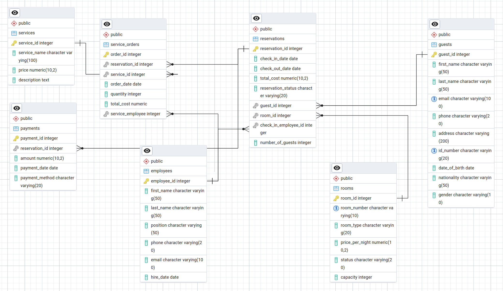

# **HOTEL AURORA**

## **Dokumentacja Techniczna Bazy Danych**

Ten dokument opisuje strukturę i logikę zaimplementowaną w pliku `baza.sql`. Baza danych obsługuje system hotelowy, zawierając mechanizmy zarządzania rezerwacjami, pokojami, gośćmi, personelem oraz finansami.

## 1. Role

W bazie zdefiniowanych jest 5 ról z rożniących się poziomami uprawnień.

### role_manager

#### Opis:

Menedżerowie posiadają pełne uprawnienia administracyjne do wszystkich zasobów w systemie. Mogą zarządzać danymi pracowników, gości, rezerwacjami, płatnościami i innymi aspektami operacyjnymi hotelu. Mają również dostęp do wszystkich tabel i funkcji, co pozwala im na podejmowanie decyzji strategicznych oraz kontrolowanie wszystkich procesów w hotelu.

#### Uprawnienia

```SQL
GRANT ALL ON SCHEMA public TO role_manager;
GRANT ALL ON PROCEDURE public.delete_db_role(IN p_role_name text) TO role_manager;
GRANT ALL ON TABLE public.employees TO role_manager;
GRANT ALL ON SEQUENCE public."Employees_EmployeeID_seq" TO role_manager;
GRANT ALL ON TABLE public.payments TO role_manager;
GRANT ALL ON SEQUENCE public."Payments_PaymentID_seq" TO role_manager;
GRANT ALL ON TABLE public.rooms TO role_manager;
GRANT ALL ON SEQUENCE public."Rooms_RoomID_seq" TO role_manager;
GRANT ALL ON TABLE public.service_orders TO role_manager;
GRANT ALL ON SEQUENCE public."ServiceOrders_OrderID_seq" TO role_manager;
GRANT ALL ON TABLE public.services TO role_manager;
GRANT ALL ON SEQUENCE public."Services_ServiceID_seq" TO role_manager;
GRANT ALL ON TABLE public.guests TO role_manager;
GRANT ALL ON SEQUENCE public.guests_guestid_seq TO role_manager;
GRANT ALL ON TABLE public.reservations TO role_manager;
GRANT ALL ON SEQUENCE public."reservations_ReservationID_seq" TO role_manager;
GRANT ALL ON TABLE public.view_current_reservations TO role_manager;
GRANT ALL ON TABLE public.view_free_rooms TO role_manager;
GRANT ALL ON TABLE public.view_guest_history TO role_manager;
GRANT ALL ON TABLE public.view_hotel_occupancy TO role_manager;
GRANT ALL ON TABLE public.view_revenue_report TO role_manager;
GRANT ALL ON TABLE public.view_upcoming_checkouts TO role_manager;
```

---

<div style="break-after: page;"></div>

### role_receptionist

#### Opis:

Pracownicy recepcji odpowiedzialni za codzienne operacje związane z rezerwacjami, obsługą gości, wprowadzaniem danych i aktualizowaniem statusów rezerwacji. Mają dostęp do pełnej funkcjonalności w zakresie zarządzania rezerwacjami, płatnościami, usługami, a także mogą przetwarzać dane gości oraz przeprowadzać czynności związane z zameldowaniem i wymeldowaniem.

#### Uprawnienia:

```SQL
GRANT USAGE ON SCHEMA public TO role_receptionist;
GRANT ALL ON PROCEDURE public.add_service_to_reservation(IN p_reservation_id integer, IN p_service_id integer, IN p_quantity integer, IN p_service_employee_id integer) TO role_receptionist;
GRANT ALL ON FUNCTION public.calculate_reservation_cost(p_room_id integer, p_check_in_date date, p_check_out_date date) TO role_receptionist;
GRANT ALL ON FUNCTION public.calculate_total_with_services(p_reservation_id integer) TO role_receptionist;
GRANT ALL ON PROCEDURE public.cancel_reservation(IN p_reservation_id integer) TO role_receptionist;
GRANT ALL ON PROCEDURE public.checkout(IN p_reservation_id integer) TO role_receptionist;
GRANT ALL ON PROCEDURE public.create_reservation(IN p_check_in_date date, IN p_check_out_date date, IN p_guest_id integer, IN p_room_id integer, IN p_employee_id integer, IN p_number_of_guests integer) TO role_receptionist;
GRANT ALL ON FUNCTION public.get_guest_loyalty_discount(p_guest_id integer) TO role_receptionist;
GRANT ALL ON FUNCTION public.get_room_availability(p_room_id integer, p_check_in_date date, p_check_out_date date) TO role_receptionist;
GRANT ALL ON PROCEDURE public.process_payment(IN p_reservation_id integer, IN p_amount numeric, IN p_payment_method character varying) TO role_receptionist;
GRANT ALL ON FUNCTION public.trg_func_calculate_reservation_cost() TO role_receptionist;
GRANT ALL ON FUNCTION public.trg_func_prevent_overlapping_reservations() TO role_receptionist;
GRANT ALL ON FUNCTION public.trg_func_update_room_status_on_checkin() TO role_receptionist;
GRANT ALL ON FUNCTION public.trg_func_update_room_status_on_checkout() TO role_receptionist;
GRANT ALL ON FUNCTION public.trg_func_update_service_order_total() TO role_receptionist;
GRANT ALL ON FUNCTION public.trg_func_validate_guest_capacity() TO role_receptionist;
GRANT SELECT,INSERT,UPDATE ON TABLE public.employees TO role_receptionist;
GRANT SELECT,USAGE ON SEQUENCE public."Employees_EmployeeID_seq" TO role_receptionist;
GRANT SELECT,INSERT,UPDATE ON TABLE public.payments TO role_receptionist;
GRANT SELECT,USAGE ON SEQUENCE public."Payments_PaymentID_seq" TO role_receptionist;
GRANT SELECT,INSERT,UPDATE ON TABLE public.rooms TO role_receptionist;
GRANT SELECT,USAGE ON SEQUENCE public."Rooms_RoomID_seq" TO role_receptionist;
GRANT SELECT,INSERT,UPDATE ON TABLE public.service_orders TO role_receptionist;
GRANT SELECT,USAGE ON SEQUENCE public."ServiceOrders_OrderID_seq" TO role_receptionist;
GRANT SELECT,INSERT,UPDATE ON TABLE public.services TO role_receptionist;
GRANT SELECT,USAGE ON SEQUENCE public."Services_ServiceID_seq" TO role_receptionist;
GRANT SELECT,INSERT,UPDATE ON TABLE public.guests TO role_receptionist;
GRANT SELECT,USAGE ON SEQUENCE public.guests_guestid_seq TO role_receptionist;
GRANT SELECT,INSERT,UPDATE ON TABLE public.reservations TO role_receptionist;
GRANT SELECT,USAGE ON SEQUENCE public."reservations_ReservationID_seq" TO role_receptionist;
GRANT SELECT,INSERT,UPDATE ON TABLE public.view_current_reservations TO role_receptionist;
GRANT SELECT,INSERT,UPDATE ON TABLE public.view_free_rooms TO role_receptionist;
GRANT SELECT,INSERT,UPDATE ON TABLE public.view_guest_history TO role_receptionist;
GRANT SELECT,INSERT,UPDATE ON TABLE public.view_hotel_occupancy TO role_receptionist;
GRANT SELECT,INSERT,UPDATE ON TABLE public.view_revenue_report TO role_receptionist;
GRANT SELECT,INSERT,UPDATE ON TABLE public.view_upcoming_checkouts TO role_receptionist;
```

---

<div style="break-after: page;"></div>

### role_accountant

#### Opis:

Księgowi mają dostęp głównie do danych finansowych, takich jak płatności, historie gości i raporty przychodów. Ich rola obejmuje analizowanie danych oraz generowanie raportów finansowych. Mają również możliwość przeglądania rezerwacji i pokoi, ale ich dostęp jest ograniczony do funkcji odczytu i weryfikacji.

#### Uprawnienia:

```SQL
GRANT USAGE ON SCHEMA public TO role_accountant;
GRANT ALL ON FUNCTION public.calculate_total_with_services(p_reservation_id integer) TO role_accountant;
GRANT SELECT ON TABLE public.employees TO role_accountant;
GRANT SELECT,INSERT,UPDATE ON TABLE public.payments TO role_accountant;
GRANT SELECT ON TABLE public.rooms TO role_accountant;
GRANT SELECT ON TABLE public.service_orders TO role_accountant;
GRANT SELECT ON TABLE public.services TO role_accountant;
GRANT SELECT ON TABLE public.guests TO role_accountant;
GRANT SELECT ON TABLE public.reservations TO role_accountant;
GRANT SELECT ON TABLE public.view_current_reservations TO role_accountant;
GRANT SELECT ON TABLE public.view_free_rooms TO role_accountant;
GRANT SELECT ON TABLE public.view_guest_history TO role_accountant;
GRANT SELECT ON TABLE public.view_hotel_occupancy TO role_accountant;
GRANT SELECT ON TABLE public.view_revenue_report TO role_accountant;
GRANT SELECT ON TABLE public.view_upcoming_checkouts TO role_accountant;
```

---

<div style="break-after: page;"></div>

### role_cleaning

#### Opis:

Pracownicy odpowiedzialni za utrzymanie czystości w hotelu. Mają dostęp głównie do informacji o dostępnych pokojach oraz statusie rezerwacji. Mogą aktualizować status pokoi (np. oznaczenie pokoju jako "posprzątany"), ale nie mają uprawnień do modyfikacji innych danych. Mają dostęp tylko do niezbędnych informacji, które są im potrzebne do wykonywania ich codziennych obowiązków.

#### Uprawnienia:

```SQL
GRANT USAGE ON SCHEMA public TO role_cleaning;
GRANT ALL ON PROCEDURE public.room_cleaned(IN p_room_id integer) TO role_cleaning;
GRANT SELECT ON TABLE public.rooms TO role_cleaning;
GRANT UPDATE(status) ON TABLE public.rooms TO role_cleaning;
GRANT SELECT ON TABLE public.guests TO role_cleaning;
GRANT SELECT ON TABLE public.reservations TO role_cleaning;
```

---

<div style="break-after: page;"></div>

### role_readonly

#### Opis:

Rola "tylko do odczytu" ma dostęp do wszystkich danych w systemie, ale nie może ich modyfikować.

#### Uprawnienia:

```SQL
GRANT USAGE ON SCHEMA public TO role_readonly;
GRANT ALL ON FUNCTION public.calculate_reservation_cost(p_room_id integer, p_check_in_date date, p_check_out_date date) TO role_readonly;
GRANT ALL ON FUNCTION public.calculate_total_with_services(p_reservation_id integer) TO role_readonly;
GRANT ALL ON FUNCTION public.get_guest_loyalty_discount(p_guest_id integer) TO role_readonly;
GRANT ALL ON FUNCTION public.get_room_availability(p_room_id integer, p_check_in_date date, p_check_out_date date) TO role_readonly;
GRANT ALL ON FUNCTION public.trg_func_calculate_reservation_cost() TO role_readonly;
GRANT ALL ON FUNCTION public.trg_func_prevent_overlapping_reservations() TO role_readonly;
GRANT ALL ON FUNCTION public.trg_func_update_room_status_on_checkin() TO role_readonly;
GRANT ALL ON FUNCTION public.trg_func_update_room_status_on_checkout() TO role_readonly;
GRANT ALL ON FUNCTION public.trg_func_update_service_order_total() TO role_readonly;
GRANT ALL ON FUNCTION public.trg_func_validate_guest_capacity() TO role_readonly;
GRANT SELECT ON TABLE public.employees TO role_readonly;
GRANT SELECT ON TABLE public.payments TO role_readonly;
GRANT SELECT ON TABLE public.rooms TO role_readonly;
GRANT SELECT ON TABLE public.service_orders TO role_readonly;
GRANT SELECT ON TABLE public.services TO role_readonly;
GRANT SELECT ON TABLE public.guests TO role_readonly;
GRANT SELECT ON TABLE public.reservations TO role_readonly;
GRANT SELECT ON TABLE public.view_current_reservations TO role_readonly;
GRANT SELECT ON TABLE public.view_free_rooms TO role_readonly;
GRANT SELECT ON TABLE public.view_guest_history TO role_readonly;
GRANT SELECT ON TABLE public.view_hotel_occupancy TO role_readonly;
GRANT SELECT ON TABLE public.view_revenue_report TO role_readonly;
GRANT SELECT ON TABLE public.view_upcoming_checkouts TO role_readonly;
```

---

<div style="break-after: page;"></div>

## 2. Tabele (Gromadzenie Danych)

### Diagram ER


### employees

#### Opis:

Lista pracowników hotelu wraz z ich stanowiskami i danymi kontaktowymi.

#### Definicja:

```SQL
CREATE TABLE public.employees (
    employee_id integer NOT NULL,
    first_name character varying(50) NOT NULL,
    last_name character varying(50) NOT NULL,
    "position" character varying(50) NOT NULL,
    phone character varying(20),
    email character varying(100),
    hire_date date NOT NULL,
    CONSTRAINT check_email_format CHECK (((email)::text ~* '^[a-zA-Z0-9._%+-]+@[a-zA-Z0-9.-]+\.[a-zA-Z]{2,}$'::text)),
    CONSTRAINT check_hire_date CHECK ((hire_date <= CURRENT_DATE)),
    CONSTRAINT check_phone_format CHECK (((phone)::text ~ '^[0-9]+$'::text))
);
```

---

<div style="break-after: page;"></div>

### guests

#### Opis:

Dane osobowe gości hotelowych (historia pobytów jest powiązana przez `guest_id`).

#### Definicja:

```SQL
CREATE TABLE public.guests (
    guest_id integer NOT NULL,
    first_name character varying(50) NOT NULL,
    last_name character varying(50) NOT NULL,
    email character varying(100),
    phone character varying(20),
    address character varying(200),
    id_number character varying(20),
    date_of_birth date,
    nationality character varying(50),
    gender character varying(10),
    CONSTRAINT check_date_of_birth CHECK ((date_of_birth <= CURRENT_DATE)),
    CONSTRAINT check_email_format CHECK (((email)::text ~* '^[a-zA-Z0-9._%+-]+@[a-zA-Z0-9.-]+\.[a-zA-Z]{2,}$'::text)),
    CONSTRAINT check_gender CHECK (((gender)::text = ANY ((ARRAY['male'::character varying, 'female'::character varying])::text[]))),
    CONSTRAINT check_phone_format CHECK (((phone)::text ~ '^[0-9]+$'::text))
);
```

---

<div style="break-after: page;"></div>

### rooms

#### Opis:

Pokoje hotelowe. Każdy pokój ma typ, cenę za noc, pojemność oraz **status** (`free`, `occupied`, `cleaning`, `renovation`).

#### Definicja:

```SQL
CREATE TABLE public.rooms (
    room_id integer NOT NULL,
    room_number character varying(10) NOT NULL,
    room_type character varying(20) NOT NULL,
    price_per_night numeric(10,2) NOT NULL,
    status character varying(20) NOT NULL,
    capacity integer NOT NULL,
    CONSTRAINT check_capacity_positive CHECK ((capacity > 0)),
    CONSTRAINT valid_room_status CHECK (((status)::text = ANY (ARRAY[('free'::character varying)::text, ('cleaning'::character varying)::text, ('occupied'::character varying)::text, ('reserved'::character varying)::text, ('maintenance'::character varying)::text])))
);

```

---

<div style="break-after: page;"></div>

### reservations

#### Opis:

Centralna tabela systemu. Łączy gościa z pokojem na określony termin. Przechowuje status rezerwacji (`confirmed`, `checked_in`, `checked_out`, `cancelled`) oraz całkowity koszt.

#### Definicja:

```SQL
CREATE TABLE public.reservations (
    reservation_id integer NOT NULL,
    check_in_date date NOT NULL,
    check_out_date date NOT NULL,
    total_cost numeric(10,2) NOT NULL,
    reservation_status character varying(20) NOT NULL,
    guest_id integer NOT NULL,
    room_id integer NOT NULL,
    check_in_employee_id integer,
    number_of_guests integer DEFAULT 1,
    CONSTRAINT check_cost CHECK ((total_cost >= (0)::numeric)),
    CONSTRAINT check_dates CHECK ((check_out_date > check_in_date)),
    CONSTRAINT check_number_of_guests CHECK ((number_of_guests > 0)),
    CONSTRAINT check_reservation_status CHECK (((reservation_status)::text = ANY (ARRAY[('checked_in'::character varying)::text, ('checked_out'::character varying)::text, ('confirmed'::character varying)::text, ('cancelled'::character varying)::text])))
);

```

---

<div style="break-after: page;"></div>

### services

#### Opis:

Katalog usług dodatkowych (np. obiad, spa) wraz z cenami.

#### Definicja:

```SQL
CREATE TABLE public.services (
    service_id integer NOT NULL,
    service_name character varying(100) NOT NULL,
    price numeric(10,2) NOT NULL,
    description text,
    CONSTRAINT check_price_positive CHECK ((price > (0)::numeric))
);
```

---

<div style="break-after: page;"></div>

### service_orders

#### Opis:

Konkretne zamówienia usług doliczane do rachunku rezerwacji.

#### Definicja:

```SQL
CREATE TABLE public.service_orders (
    order_id integer NOT NULL,
    reservation_id integer NOT NULL,
    service_id integer NOT NULL,
    order_date date NOT NULL,
    quantity integer NOT NULL,
    total_cost numeric NOT NULL,
    service_employee integer,
    CONSTRAINT check_order_date CHECK ((order_date <= CURRENT_DATE)),
    CONSTRAINT check_quantity_positive CHECK ((quantity > 0)),
    CONSTRAINT check_total_cost_non_negative CHECK ((total_cost >= (0)::numeric))
);
```

---

<div style="break-after: page;"></div>

### payments

#### Opis:

Rejestr wpłat dokonanych przez gości.

#### Definicja:

```SQL
CREATE TABLE public.payments (
    payment_id integer NOT NULL,
    reservation_id integer NOT NULL,
    amount numeric(10,2) NOT NULL,
    payment_date date NOT NULL,
    payment_method character varying(20) NOT NULL,
    CONSTRAINT check_amount_positive CHECK ((amount > (0)::numeric)),
    CONSTRAINT check_payment_date CHECK ((payment_date <= CURRENT_DATE)),
    CONSTRAINT check_payment_method CHECK (((payment_method)::text = ANY ((ARRAY['card'::character varying, 'bank_transfer'::character varying, 'cash'::character varying, 'blik'::character varying])::text[])))
);
```

---

<div style="break-after: page;"></div>

## 3. Triggery (Automatyzacja i Walidacja)

Triggery to automatyczne procedury uruchamiane w reakcji na zmiany w tabelach. W tym systemie pełnią kluczową rolę w zapewnieniu spójności danych.

| Nazwa Triggera                             | Tabela           | Wyzwalacz (Event) | Opis Działania                                                                                                                  |
| :----------------------------------------- | :--------------- | :---------------- | :------------------------------------------------------------------------------------------------------------------------------ |
| **`trg_calculate_reservation_cost`**       | `reservations`   | INSERT / UPDATE   | Automatycznie oblicza `total_cost` rezerwacji na podstawie ceny pokoju i długości pobytu (liczby nocy).                         |
| **`trg_prevent_overlapping_reservations`** | `reservations`   | INSERT / UPDATE   | **Kluczowe zabezpieczenie.** Sprawdza, czy wybrany pokój nie jest już zajęty w podanym terminie. Blokuje dublowanie rezerwacji. |
| **`trg_validate_guest_capacity`**          | `reservations`   | INSERT / UPDATE   | Sprawdza, czy liczba gości nie przekracza pojemności (`capacity`) danego pokoju.                                                |
| **`trg_update_room_status_on_checkin`**    | `reservations`   | UPDATE (status)   | Gdy status rezerwacji zmieni się na `checked_in`, automatycznie zmienia status pokoju na `occupied` (zajęty).                   |
| **`trg_update_room_status_on_checkout`**   | `reservations`   | UPDATE (status)   | Gdy status rezerwacji zmieni się na `checked_out`, automatycznie zmienia status pokoju na `cleaning` (do sprzątania).           |
| **`trg_update_service_order_total`**       | `service_orders` | INSERT / UPDATE   | Automatycznie oblicza koszt zamówienia usługi (`cena` \* `ilość`) i aktualizuje rekord.                                         |

### Definicje

#### trg_calculate_reservation_cost

```SQL
CREATE FUNCTION public.trg_func_calculate_reservation_cost() RETURNS trigger
    LANGUAGE plpgsql
    AS $$
DECLARE
    v_nights INTEGER;
    v_price_per_night NUMERIC(10,2);
BEGIN
    SELECT price_per_night INTO v_price_per_night
    FROM rooms WHERE room_id = NEW.room_id;

    v_nights := NEW.check_out_date - NEW.check_in_date;

    IF v_nights <= 0 THEN
        RAISE EXCEPTION 'Data wymeldowania musi być późniejsza niż zameldowania';
    END IF;

    NEW.total_cost := ROUND(v_price_per_night * v_nights, 2);

    RETURN NEW;
END;
$$;
```

---

<div style="break-after: page;"></div>

#### trg_prevent_overlapping_reservations

```SQL
CREATE FUNCTION public.trg_func_prevent_overlapping_reservations() RETURNS trigger
    LANGUAGE plpgsql
    AS $$
BEGIN
    IF EXISTS (
        SELECT 1
        FROM reservations r
        WHERE r.room_id = NEW.room_id
          AND r.reservation_id <> NEW.reservation_id
          AND r.reservation_status IN ('confirmed', 'checked_in')
          AND NEW.check_in_date < r.check_out_date
          AND NEW.check_out_date > r.check_in_date
    ) THEN
        RAISE EXCEPTION 'Pokój % jest już zarezerwowany w terminie % – %',
            NEW.room_id, NEW.check_in_date, NEW.check_out_date;
    END IF;

    RETURN NEW;
END;
$$;
```

---

<div style="break-after: page;"></div>

#### trg_validate_guest_capacity

```SQL
CREATE FUNCTION public.trg_func_validate_guest_capacity() RETURNS trigger
    LANGUAGE plpgsql
    AS $$
DECLARE
    v_capacity INTEGER;
BEGIN
    IF NEW.number_of_guests IS NULL THEN
        NEW.number_of_guests := 1;
    END IF;

    SELECT capacity INTO v_capacity
    FROM rooms WHERE room_id = NEW.room_id;

    IF NEW.number_of_guests > v_capacity THEN
        RAISE EXCEPTION 'Liczba gości (%) przekracza pojemność pokoju % (%)',
            NEW.number_of_guests, NEW.room_id, v_capacity;
    END IF;

    RETURN NEW;
END;
$$;
```

---

<div style="break-after: page;"></div>

#### trg_update_room_status_on_checkin

```SQL
CREATE FUNCTION public.trg_func_update_room_status_on_checkin() RETURNS trigger
    LANGUAGE plpgsql
    AS $$
BEGIN
    IF NEW.reservation_status = 'checked_in'
       AND (OLD.reservation_status IS DISTINCT FROM 'checked_in') THEN

        UPDATE rooms
        SET status = 'occupied'
        WHERE room_id = NEW.room_id;

        RAISE NOTICE 'Pokój % zajęty po zameldowaniu (rezerwacja %)', NEW.room_id, NEW.reservation_id;
    END IF;

    RETURN NEW;
END;
$$;
```

---

<div style="break-after: page;"></div>

#### trg_update_room_status_on_checkout

```SQL
CREATE FUNCTION public.trg_func_update_room_status_on_checkout() RETURNS trigger
    LANGUAGE plpgsql
    AS $$
BEGIN
    IF NEW.reservation_status = 'checked_out'
       AND OLD.reservation_status <> 'checked_out' THEN

        UPDATE rooms
        SET status = 'cleaning'
        WHERE room_id = NEW.room_id;

        RAISE NOTICE 'Pokój % wymaga sprzątania po wymeldowaniu (rezerwacja %)', NEW.room_id, NEW.reservation_id;
    END IF;

    RETURN NEW;
END;
$$;
```

---

<div style="break-after: page;"></div>

#### trg_update_service_order_total

```SQL
CREATE FUNCTION public.trg_func_update_service_order_total() RETURNS trigger
    LANGUAGE plpgsql
    AS $$
DECLARE
    v_price NUMERIC(10,2);
BEGIN
    SELECT price INTO v_price
    FROM services WHERE service_id = NEW.service_id;

    IF NOT FOUND THEN
        RAISE EXCEPTION 'Usługa o ID % nie istnieje', NEW.service_id;
    END IF;

    NEW.total_cost := ROUND(v_price * NEW.quantity, 2);

    RETURN NEW;
END;
$$;
```

---

<div style="break-after: page;"></div>

## 4. Procedury Składowane

Procedury udostępniają do wykonywania operacji na bazie, ułatwiając pracę aplikacji i zmniejszając ryzyko błędów.

### create_reservation(...)

- Sprawdza dostępność pokoju i poprawność dat.
- Tworzy nową rezerwację ze statusem `confirmed`.
- Oblicza koszt z uwzględnieniem **rabatu lojalnościowego**.

#### Definicja

```SQL
CREATE PROCEDURE public.create_reservation(IN p_check_in_date date, IN p_check_out_date date, IN p_guest_id integer, IN p_room_id integer, IN p_employee_id integer DEFAULT NULL::integer, IN p_number_of_guests integer DEFAULT 1)
    LANGUAGE plpgsql
    AS $$
DECLARE
    v_nights INTEGER;
    v_price_per_night NUMERIC(10,2);
    v_total_cost NUMERIC(10,2);
    v_room_status VARCHAR(20);
    v_discount NUMERIC(3,2);
    v_discount_percent INTEGER;
BEGIN
    -- Sprawdzenie dostępności pokoju w podanym terminie
    PERFORM 1
    FROM reservations r
    WHERE r.room_id = p_room_id
      AND r.reservation_status IN ('confirmed', 'checked_in')
      AND (p_check_in_date < r.check_out_date AND p_check_out_date > r.check_in_date);

    IF FOUND THEN
        RAISE EXCEPTION 'Pokój % jest już zarezerwowany w podanym terminie', p_room_id;
    END IF;

    -- Pobranie ceny za noc i statusu pokoju
    SELECT price_per_night, status
    INTO v_price_per_night, v_room_status
    FROM rooms
    WHERE room_id = p_room_id;

    IF NOT FOUND THEN
        RAISE EXCEPTION 'Pokój o ID % nie istnieje', p_room_id;
    END IF;

    IF v_room_status != 'free' AND v_room_status != 'cleaning' THEN
        RAISE EXCEPTION 'Pokój % nie jest dostępny (status: %)', p_room_id, v_room_status;
    END IF;

    -- Obliczenie liczby nocy
    v_nights := p_check_out_date - p_check_in_date;
    IF v_nights <= 0 THEN
        RAISE EXCEPTION 'Data wymeldowania musi być późniejsza niż data zameldowania';
    END IF;

    -- System lojalnościowy - pobranie rabatu dla gościa
    v_discount := get_guest_loyalty_discount(p_guest_id);
    v_discount_percent := (v_discount * 100)::INTEGER;

    -- Obliczenie kosztu z uwzględnieniem rabatu
    v_total_cost := ROUND(v_nights * v_price_per_night * (1 - v_discount), 2);

    -- Wstawienie rezerwacji
    INSERT INTO reservations (
        check_in_date, check_out_date, total_cost,
        reservation_status, guest_id, room_id, check_in_employee_id, number_of_guests
    ) VALUES (
        p_check_in_date, p_check_out_date, v_total_cost,
        'confirmed', p_guest_id, p_room_id, p_employee_id, p_number_of_guests
    );

    IF v_discount_percent > 0 THEN
        RAISE NOTICE 'Rezerwacja utworzona pomyślnie. Koszt: % PLN za % nocy (rabat lojalnościowy: %)', v_total_cost, v_nights, v_discount_percent || '%';
    ELSE
        RAISE NOTICE 'Rezerwacja utworzona pomyślnie. Koszt: % PLN za % nocy', v_total_cost, v_nights;
    END IF;
END;
$$;
```

---

<div style="break-after: page;"></div>

### checkout(reservation_id)

- Obsługuje proces wymeldowania.
- Zmienia status rezerwacji na `checked_out`.
- Zmienia status pokoju na `cleaning` (wymusza sprzątanie po gościu).

#### Definicja

```SQL
CREATE PROCEDURE public.checkout(IN p_reservation_id integer)
    LANGUAGE plpgsql
    AS $$
DECLARE
    v_room_id INTEGER;
    v_status VARCHAR(20);
BEGIN
    SELECT room_id, reservation_status
    INTO v_room_id, v_status
    FROM reservations
    WHERE reservation_id = p_reservation_id;

    IF NOT FOUND THEN
        RAISE EXCEPTION 'Rezerwacja % nie istnieje', p_reservation_id;
    END IF;

    IF v_status != 'checked_in' AND v_status != 'confirmed' THEN
        RAISE EXCEPTION 'Rezerwacja ma nieprawidłowy status: %', v_status;
    END IF;

    -- Zmiana statusu rezerwacji
    UPDATE reservations
    SET reservation_status = 'checked_out'
    WHERE reservation_id = p_reservation_id;

    -- Pokój do sprzątania
    UPDATE rooms
    SET status = 'cleaning'
    WHERE room_id = v_room_id;

    RAISE NOTICE 'Gość wymeldowany. Pokój % wymaga sprzątania', v_room_id;
END;
$$;
```

---

<div style="break-after: page;"></div>

### cancel_reservation(reservation_id)

- Anuluje rezerwację (status `cancelled`).
- Zwalnia pokój (status `free`), jeśli nie był już zajęty.

#### Definicja

```SQL
CREATE PROCEDURE public.cancel_reservation(IN p_reservation_id integer)
    LANGUAGE plpgsql
    AS $$
DECLARE
    v_room_id INTEGER;
    v_status VARCHAR(20);
BEGIN
    SELECT room_id, reservation_status
    INTO v_room_id, v_status
    FROM reservations
    WHERE reservation_id = p_reservation_id;

    IF NOT FOUND THEN
        RAISE EXCEPTION 'Rezerwacja % nie istnieje', p_reservation_id;
    END IF;

    IF v_status = 'checked_out' THEN
        RAISE EXCEPTION 'Rezerwacja już wymeldowana – nie można anulować';
    END IF;

    IF v_status = 'checked_in' THEN
        RAISE EXCEPTION 'Nie można anulować rezerwacji z zameldowanym gościem. Najpierw wymelduj.';
    END IF;

    -- Zmiana statusu rezerwacji
    UPDATE reservations
    SET reservation_status = 'cancelled'
    WHERE reservation_id = p_reservation_id;

    -- Zwolnienie pokoju
    UPDATE rooms
    SET status = 'free'
    WHERE room_id = v_room_id;

    RAISE NOTICE 'Rezerwacja % została anulowana, pokój zwolniony', p_reservation_id;
END;
$$;
```

---

<div style="break-after: page;"></div>

### add_service_to_reservation(...)

- Dodaje usługę do rachunku gościa.
- Aktualizuje całkowity koszt rezerwacji.

#### Definicja

```SQL
CREATE PROCEDURE public.add_service_to_reservation(IN p_reservation_id integer, IN p_service_id integer, IN p_quantity integer DEFAULT 1, IN p_service_employee_id integer DEFAULT NULL::integer)
    LANGUAGE plpgsql
    AS $$
DECLARE
    v_service_price NUMERIC(10,2);
    v_total_cost NUMERIC;
    v_res_status VARCHAR(20);
BEGIN
    -- Sprawdzenie czy rezerwacja istnieje i jest aktywna
    SELECT reservation_status INTO v_res_status
    FROM reservations WHERE reservation_id = p_reservation_id;

    IF NOT FOUND THEN
        RAISE EXCEPTION 'Rezerwacja % nie istnieje', p_reservation_id;
    END IF;

    IF v_res_status NOT IN ('confirmed', 'checked_in') THEN
        RAISE EXCEPTION 'Nie można dodać usługi do rezerwacji o statusie: %', v_res_status;
    END IF;

    -- Cena usługi
    SELECT price INTO v_service_price
    FROM services WHERE service_id = p_service_id;

    IF NOT FOUND THEN
        RAISE EXCEPTION 'Usługa % nie istnieje', p_service_id;
    END IF;

    v_total_cost := v_service_price * p_quantity;

    -- Dodanie zamówienia usługi
    INSERT INTO service_orders (
        reservation_id, service_id, order_date,
        quantity, total_cost, service_employee
    ) VALUES (
        p_reservation_id, p_service_id, CURRENT_DATE,
        p_quantity, v_total_cost, p_service_employee_id
    );

    -- Aktualizacja całkowitego kosztu rezerwacji
    UPDATE reservations
    SET total_cost = total_cost + v_total_cost
    WHERE reservation_id = p_reservation_id;

    RAISE NOTICE 'Usługa dodana. Dodatkowy koszt: % PLN', v_total_cost;
END;
$$;
```

---

<div style="break-after: page;"></div>

### process_payment(...)

- Rejestruje wpłatę w systemie.
- Sprawdza, czy rezerwacja została w pełni opłacona.

#### Definicja

```SQL
CREATE PROCEDURE public.process_payment(IN p_reservation_id integer, IN p_amount numeric, IN p_payment_method character varying)
    LANGUAGE plpgsql
    AS $$
DECLARE
    v_current_total NUMERIC(10,2);
    v_res_status VARCHAR(20);
BEGIN
    SELECT total_cost, reservation_status
    INTO v_current_total, v_res_status
    FROM reservations
    WHERE reservation_id = p_reservation_id;

    IF NOT FOUND THEN
        RAISE EXCEPTION 'Rezerwacja % nie istnieje', p_reservation_id;
    END IF;

    IF p_amount <= 0 THEN
        RAISE EXCEPTION 'Kwota płatności musi być większa od zera';
    END IF;

    -- Wstawienie płatności
    INSERT INTO payments (
        reservation_id, amount, payment_date, payment_method
    ) VALUES (
        p_reservation_id, p_amount, CURRENT_DATE, p_payment_method
    );

    RAISE NOTICE 'Zarejestrowano płatność % PLN metodą: %', p_amount, p_payment_method;

    IF (SELECT SUM(amount) FROM payments WHERE reservation_id = p_reservation_id) >= v_current_total THEN
        RAISE NOTICE 'Rezerwacja % w pełni opłacona!', p_reservation_id;
    END IF;
END;
$$;
```

---

<div style="break-after: page;"></div>

### room_cleaned(room_id)

- Procedura dla serwisu sprzątającego.
- Zmienia status pokoju z `cleaning` na `free`, udostępniając go pod nowe rezerwacje.

#### Definicja

```SQL
CREATE PROCEDURE public.room_cleaned(IN p_room_id integer)
    LANGUAGE plpgsql SECURITY DEFINER
    AS $$
BEGIN
    UPDATE rooms SET status = 'free' WHERE room_id = p_room_id AND status = 'cleaning';
       IF NOT FOUND THEN
        RAISE EXCEPTION 'Pokój % nie jest w statusie sprzątania lub nie istnieje', p_room_id;
    END IF;
    RAISE NOTICE 'Pokój % oznaczony jako wolny', p_room_id;
END;
$$;
```

---

<div style="break-after: page;"></div>

### create_db_user_and_employee(...)

- Tworzy fizycznie użytkownika bazy danych (PostgreSQL user).
- Przypisuje mu rolę zgodną ze stanowiskiem (np. `role_receptionist`).
- Dodaje wpis do tabeli `employees`.

#### Definicja

```SQL
CREATE PROCEDURE public.create_db_user_and_employee(IN p_password text, IN p_first_name character varying, IN p_last_name character varying, IN p_position character varying, IN p_hire_date date, IN p_email character varying, IN p_phone character varying DEFAULT NULL::character varying)
    LANGUAGE plpgsql SECURITY DEFINER
    AS $$
DECLARE
    v_db_role_name VARCHAR(100);
    v_position_lower VARCHAR(50) := LOWER(p_position);
    v_db_username VARCHAR(100) := p_email;
BEGIN
    IF v_db_username IS NULL OR v_db_username = '' THEN
        RAISE EXCEPTION 'Adres email nie może być pusty, ponieważ jest używany jako login bazy danych.';
    END IF;

    IF v_position_lower LIKE '%receptionist%' THEN
        v_db_role_name := 'role_receptionist';
    ELSIF v_position_lower LIKE '%manager%' THEN
        v_db_role_name := 'role_manager';
    ELSIF v_position_lower LIKE '%accountant%' THEN
        v_db_role_name := 'role_accountant';
    ELSIF v_position_lower LIKE '%cleaning%' THEN
        v_db_role_name := 'role_cleaning';
    ELSE
        RAISE EXCEPTION 'Nie można przypisać pozycji "%" do żadnej z ról bazy danych. Użytkownik nie został utworzony.', p_position;
    END IF;

    EXECUTE format('CREATE ROLE %I LOGIN PASSWORD %L', v_db_username, p_password);

    EXECUTE format('GRANT %I TO %I', v_db_role_name, v_db_username);

    INSERT INTO public.employees (
        first_name,
        last_name,
        position,
        phone,
        email,
        hire_date
    ) VALUES (
        p_first_name,
        p_last_name,
        p_position,
        p_phone,
        p_email,
        p_hire_date
    );

    RAISE NOTICE 'Utworzono nowego użytkownika DB: % z rolą DB: % (Pozycja: %)',
        v_db_username, v_db_role_name, p_position;

EXCEPTION
    WHEN duplicate_object THEN
        RAISE EXCEPTION 'Użytkownik bazy danych/email % już istnieje.', v_db_username;
    WHEN others THEN
        RAISE EXCEPTION 'Błąd podczas tworzenia użytkownika/pracownika: %', SQLERRM;
END;
$$;
```

---

<div style="break-after: page;"></div>

### delete_db_role(...)

- Pozwala na usunięcie roli użytkownika bazy

#### Definicja

```SQL
CREATE PROCEDURE public.delete_db_role(IN p_role_name text)
    LANGUAGE plpgsql SECURITY DEFINER
    AS $$
BEGIN
    IF p_role_name IN ('postgres', 'admin', 'role_manager', 'role_receptionist', 'role_cleaning', 'role_accountant') THEN
        RAISE EXCEPTION 'Cannot delete system role: %', p_role_name;
    END IF;
    EXECUTE format('DROP ROLE IF EXISTS %I', p_role_name);
END;
$$;

```

---

<div style="break-after: page;"></div>

## 5. Funkcje Pomocnicze

Używane wewnątrz zapytań SQL lub innej logiki.

### get_room_availability(...)

Zwraca `TRUE`/`FALSE` sprawdzając, czy pokój jest wolny w podanym terminie.

#### Definicja

```SQL
CREATE FUNCTION public.get_room_availability(p_room_id integer, p_check_in_date date, p_check_out_date date) RETURNS boolean
    LANGUAGE sql
    AS $$
    SELECT NOT EXISTS (
        SELECT 1
        FROM reservations r
        WHERE r.room_id = p_room_id
          AND r.reservation_status IN ('confirmed', 'checked_in')
          AND p_check_in_date < r.check_out_date
          AND p_check_out_date > r.check_in_date
    );
$$;
```

---

<div style="break-after: page;"></div>

### calculate_reservation_cost(...)

Zwraca wyliczony koszt pobytu bez modyfikacji danych.

#### Definicja

```SQL
CREATE FUNCTION public.calculate_reservation_cost(p_room_id integer, p_check_in_date date, p_check_out_date date) RETURNS numeric
    LANGUAGE plpgsql
    AS $$
DECLARE
    v_price_per_night NUMERIC(10,2);
    v_nights INTEGER;
BEGIN
    -- Pobranie ceny za noc
    SELECT price_per_night INTO v_price_per_night
    FROM rooms WHERE room_id = p_room_id;

    IF NOT FOUND THEN
        RAISE EXCEPTION 'Pokój o ID % nie istnieje', p_room_id;
    END IF;

    v_nights := p_check_out_date - p_check_in_date;
    IF v_nights <= 0 THEN
        RAISE EXCEPTION 'Data wymeldowania musi być późniejsza niż zameldowania';
    END IF;

    RETURN ROUND(v_price_per_night * v_nights, 2);
END;
$$;
```

---

<div style="break-after: page;"></div>

### get_guest_loyalty_discount(...)

Oblicza zniżkę lojalnościową na podstawie liczby przeszłych wizyt gościa.

#### Definicja

```SQL
CREATE FUNCTION public.get_guest_loyalty_discount(p_guest_id integer) RETURNS numeric
    LANGUAGE plpgsql
    AS $$
DECLARE
    v_past_stays INTEGER;
BEGIN
    SELECT COUNT(*) INTO v_past_stays
    FROM reservations
    WHERE guest_id = p_guest_id
      AND reservation_status = 'checked_out'
      AND check_out_date < CURRENT_DATE;

    RETURN CASE
        WHEN v_past_stays >= 10 THEN 0.15
        WHEN v_past_stays >= 5  THEN 0.10
        WHEN v_past_stays >= 2  THEN 0.05
        ELSE 0.00
    END;
END;
$$;
```

---

<div style="break-after: page;"></div>

### calculate_total_with_services(p_reservation_id)

Zwraca koszt pobytu wraz z usługami

#### Definicja

```SQL
CREATE FUNCTION public.calculate_total_with_services(p_reservation_id integer) RETURNS numeric
    LANGUAGE sql
    AS $$
    SELECT
        COALESCE(r.total_cost, 0) + COALESCE(SUM(so.total_cost), 0)
    FROM reservations r
    LEFT JOIN service_orders so ON so.reservation_id = r.reservation_id
    WHERE r.reservation_id = p_reservation_id
    GROUP BY r.reservation_id, r.total_cost;
$$;
```

---

<div style="break-after: page;"></div>

## 6. Widoki

Gotowe zapytania ułatwiające podgląd danych.

### view_free_rooms

Lista aktualnie wolnych pokoi.

#### Definicja

```SQL
CREATE VIEW public.view_free_rooms AS
 SELECT room_id,
    room_number,
    room_type,
    price_per_night,
    capacity
   FROM public.rooms
  WHERE ((status)::text = 'free'::text);
```

### view_hotel_occupancy

Statystyki zajętości hotelu (liczba zajętych pokoi, procent obłożenia).

#### Definicja

```SQL
CREATE VIEW public.view_hotel_occupancy AS
 SELECT count(*) FILTER (WHERE ((status)::text = 'occupied'::text)) AS occupied_rooms,
    count(*) AS total_rooms,
        CASE
            WHEN (count(*) = 0) THEN (0)::numeric
            ELSE round((((count(*) FILTER (WHERE ((status)::text = 'occupied'::text)))::numeric / (count(*))::numeric) * (100)::numeric), 2)
        END AS occupancy_percentage
   FROM public.rooms;
```

---

<div style="break-after: page;"></div>

### view_revenue_report

Raport finansowy z podziałem na miesiące.

#### Definicja

```SQL
CREATE VIEW public.view_revenue_report AS
 SELECT date_trunc('month'::text, (payment_date)::timestamp with time zone) AS month,
    sum(amount) AS total_revenue
   FROM public.payments
  GROUP BY (date_trunc('month'::text, (payment_date)::timestamp with time zone))
  ORDER BY (date_trunc('month'::text, (payment_date)::timestamp with time zone)) DESC;
```

### view_guest_history

Podsumowanie historii gości (ilość pobytów, suma wydatków).

#### Definicja

```SQL
CREATE OR REPLACE VIEW public.view_guest_history AS
 SELECT guests.guest_id,
    guests.first_name,
    guests.last_name,
    count(reservations.reservation_id) AS total_stays,
    sum(reservations.total_cost) AS total_spent
   FROM (public.guests
     LEFT JOIN public.reservations ON ((guests.guest_id = reservations.guest_id)))
  GROUP BY guests.guest_id;
```

---

<div style="break-after: page;"></div>

### view_current_reservations

Obecne rezerwacje

#### Definicja

```SQL
CREATE VIEW public.view_current_reservations AS
 SELECT r.reservation_id,
    r.guest_id,
    (((g.first_name)::text || ' '::text) || (g.last_name)::text) AS guest_name,
    ro.room_number,
    r.check_in_date,
    r.check_out_date,
    r.reservation_status,
    r.total_cost,
    r.number_of_guests
   FROM ((public.reservations r
     JOIN public.guests g ON ((r.guest_id = g.guest_id)))
     JOIN public.rooms ro ON ((r.room_id = ro.room_id)))
  WHERE (((r.reservation_status)::text = 'checked_in'::text) OR ((r.reservation_status)::text = 'confirmed'::text))
  ORDER BY r.check_in_date DESC;
```


### view_upcoming_checkouts

Goście którzy wymeldują się w ciągu 3 następnych dni

#### Definicja

```SQL
CREATE VIEW public.view_upcoming_checkouts AS
 SELECT reservations.reservation_id,
    guests.first_name,
    guests.last_name,
    rooms.room_number,
    reservations.check_out_date
   FROM ((public.reservations
     JOIN public.guests ON ((reservations.guest_id = guests.guest_id)))
     JOIN public.rooms ON ((reservations.room_id = rooms.room_id)))
  WHERE ((reservations.check_out_date >= CURRENT_DATE) AND (reservations.check_out_date <= (CURRENT_DATE + '3 days'::interval)) AND ((reservations.reservation_status)::text = 'in_progress'::text));
```

---

<div style="break-after: page;"></div>

### view_all_reservations

Zwraca wszystkie rezerwacje

#### Definicja

```SQL
CREATE VIEW public.view_all_reservations AS
 SELECT r.reservation_id,
    r.guest_id,
    (((g.first_name)::text || ' '::text) || (g.last_name)::text) AS guest_name,
    ro.room_number,
    r.check_in_date,
    r.check_out_date,
    r.reservation_status,
    r.total_cost,
    r.number_of_guests
   FROM ((public.reservations r
     JOIN public.guests g ON ((r.guest_id = g.guest_id)))
     JOIN public.rooms ro ON ((r.room_id = ro.room_id)))
  ORDER BY r.check_in_date DESC;
```
